# Credit Limit Increase Model Card
### Basic Information

* **Person or organization developing model**: Xinyi Li, `xinyili0026@gwu.edu`
* **Model date**: August, 2022
* **Model version**: 1.0
* **License**: MIT
* **Model implementation code**: [DNSC_6301_0823.ipynb](DNSC_6301_0823.ipynb)

### Intended Use
* **Primary intended uses**: This model is the assignment in the GWU DNSC 6301 bootcamp. In this model, the probability of default classifier would be shown, determining eligibility for a credit limit increase.
* **Primary intended users**: Professor Johnston Hall.
* **Out-of-scope use cases**: Any other use is out-of-scope.

### Training Data


* Data dictionary: 

| Name | Modeling Role | Measurement Level| Description|
| ---- | ------------- | ---------------- | ---------- |
|**ID**| ID | int | unique row indentifier |
| **LIMIT_BAL** | input | float | amount of previously awarded credit |
| **SEX** | demographic information | int | 1 = male; 2 = female
| **RACE** | demographic information | int | 1 = hispanic; 2 = black; 3 = white; 4 = asian |
| **EDUCATION** | demographic information | int | 1 = graduate school; 2 = university; 3 = high school; 4 = others |
| **MARRIAGE** | demographic information | int | 1 = married; 2 = single; 3 = others |
| **AGE** | demographic information | int | age in years |
| **PAY_0, PAY_2 - PAY_6** | inputs | int | history of past payment; PAY_0 = the repayment status in September, 2005; PAY_2 = the repayment status in August, 2005; ...; PAY_6 = the repayment status in April, 2005. The measurement scale for the repayment status is: -1 = pay duly; 1 = payment delay for one month; 2 = payment delay for two months; ...; 8 = payment delay for eight months; 9 = payment delay for nine months and above |
| **BILL_AMT1 - BILL_AMT6** | inputs | float | amount of bill statement; BILL_AMNT1 = amount of bill statement in September, 2005; BILL_AMT2 = amount of bill statement in August, 2005; ...; BILL_AMT6 = amount of bill statement in April, 2005 |
| **PAY_AMT1 - PAY_AMT6** | inputs | float | amount of previous payment; PAY_AMT1 = amount paid in September, 2005; PAY_AMT2 = amount paid in August, 2005; ...; PAY_AMT6 = amount paid in April, 2005 |
| **DELINQ_NEXT**| target | int | whether a customer's next payment is delinquent (late), 1 = late; 0 = on-time |
* **Source of training data**: GWU Blackboard
* **How training data was divided into training and validation data**: 50% training, 25% validation, 25% test
* **Number of rows in training and validation data**:
  * Training rows: 15,000
  * Validation rows: 7,500

### Test Data
* **Source of test data**: GWU Blackboard
* **Number of rows in test data**: 7,500
* **State any differences in columns between training and test data**: None

### Model details
* **Columns used as inputs in the final model**: 'LIMIT_BAL',
       'PAY_0', 'PAY_2', 'PAY_3', 'PAY_4', 'PAY_5', 'PAY_6', 'BILL_AMT1',
       'BILL_AMT2', 'BILL_AMT3', 'BILL_AMT4', 'BILL_AMT5', 'BILL_AMT6',
       'PAY_AMT1', 'PAY_AMT2', 'PAY_AMT3', 'PAY_AMT4', 'PAY_AMT5', 'PAY_AMT6'
* **Column(s) used as target(s) in the final model**: 'DELINQ_NEXT'
* **Type of model**: Decision Tree 
* **Software used to implement the model**: Python, scikit-learn
* **Version of the modeling software**: Python version: 3.7.13 Sklearn version: 1.0.2
* **Hyperparameters or other settings of your model**: 
```
DecisionTreeClassifier(ccp_alpha=0.0, class_weight=None, criterion='gini',
                       max_depth=6, max_features=None, max_leaf_nodes=None,
                       min_impurity_decrease=0.0, min_impurity_split=None,
                       min_samples_leaf=1, min_samples_split=2,
                       min_weight_fraction_leaf=0.0, presort='deprecated',
                       random_state=12345, splitter='best')`
```
### Quantitative Analysis


#### Metrics used to evaluate your final model (AUC and AIR)
* Test AUC-0.7438


#### State the final values, neatly -- as bullets or a table, of the metrics for all data: training, validation, and test data
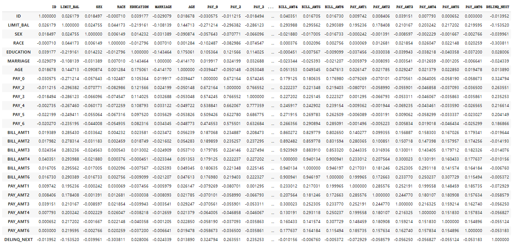
* **correlation**: This table shows the correlation between different factors, where the diagonal correlation is one, because the factor is perfectly correlated with itself.
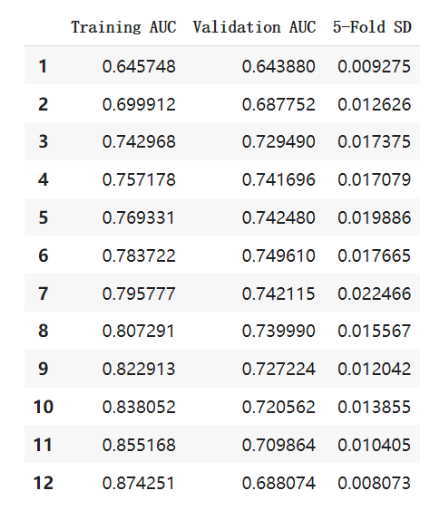
* **gap**: 
This table shows the predicted and actual values for different races. For example, in the case of predictions for whites, both actual and predicted 1 occurred 176 times, both actual and predicted 0 occurred 1228 times, actual 0 predicted 1 813 times, and actual 1 predicted 0 72 times. The predicted acceptance of the combined white population was 0.568, while this table also makes a comparison of the acceptance between different racial groups.
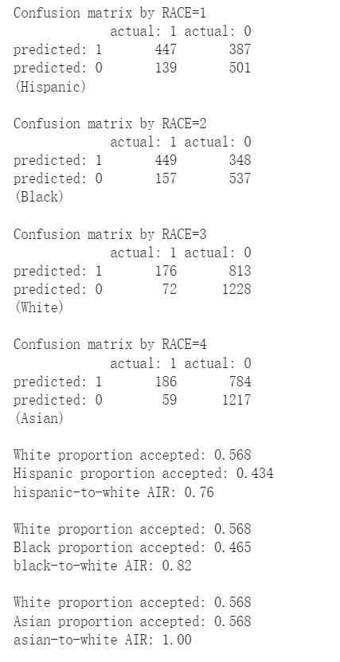
* **race**: This table shows the predicted and actual values for different races. For example, in the case of predictions for whites, both actual and predicted 1 occurred 176 times, both actual and predicted 0 occurred 1228 times, actual 0 predicted 1 813 times, and actual 1 predicted 0 72 times. The predicted acceptance of the combined white population was 0.568, while this table also makes a comparison of the acceptance between different racial groups.
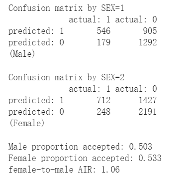
* **sex**:This table shows the predicted and actual values for different genders. 
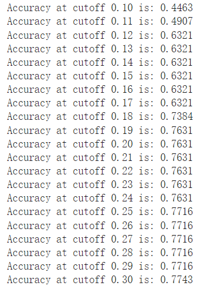
* **accuracy**: As the cutoff value increases, the accuracy goes up.
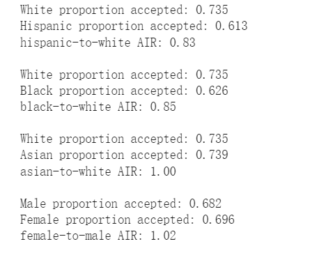
* **acceptair**: This table shows the AIR data for different races。
#### Provide any plots related to your data or final model
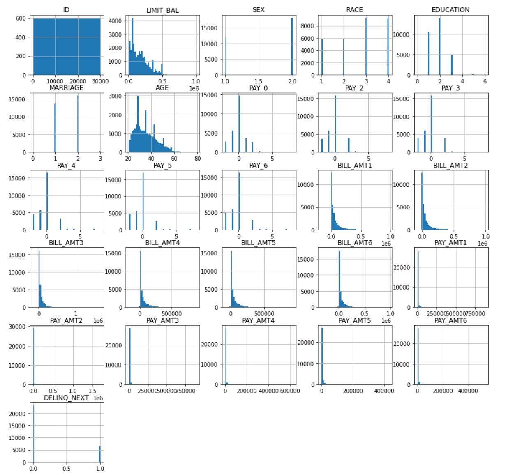
* **data column**: The image shows the data for each factor, divided into continuous and discrete variables. Discrete variables, such as the number of payments are bars of their respective discrete distributions, and the length of the bars is determined by the frequency of payments; continuous variables, such as the number of loans repaid, are shown as ID data, but the size of the ID data has no practical significance.
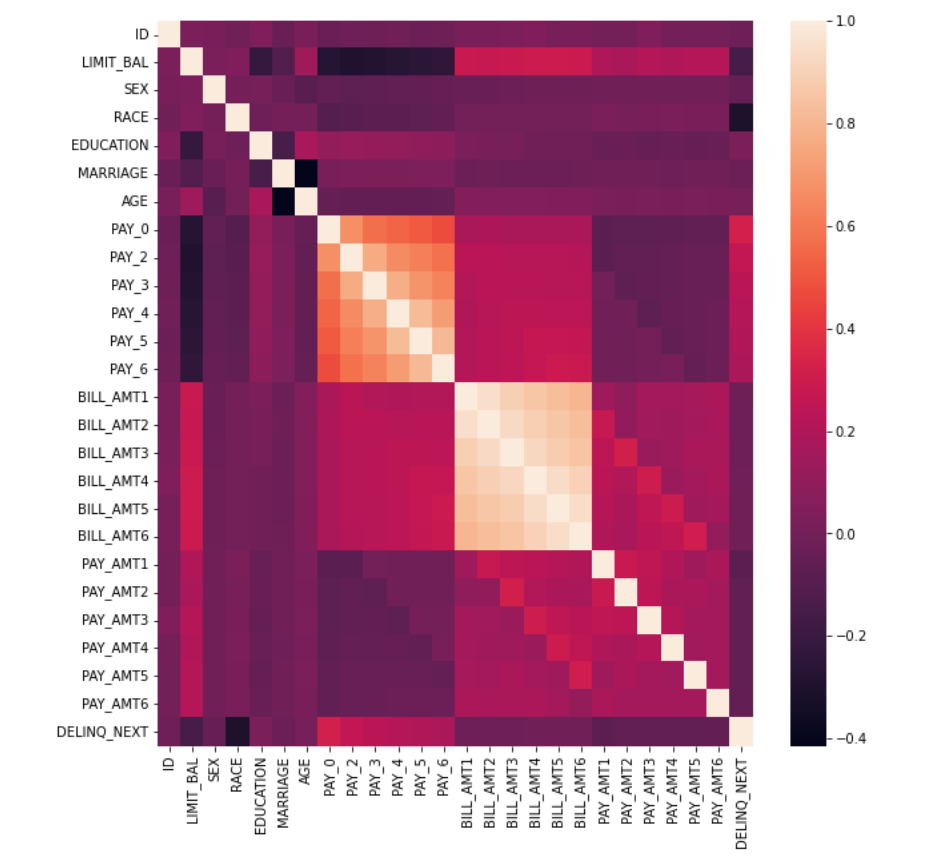
* **correlation**: 'LIMIT_BAL',
       'PAY_0', 'PAY_2', 'PAY_3', 'PAY_4', 'PAY_5', 'PAY_6', 'BILL_AMT1',
       'BILL_AMT2', 'BILL_AMT3', 'BILL_AMT4', 'BILL_AMT5', 'BILL_AMT6',
       'PAY_AMT1', 'PAY_AMT2', 'PAY_AMT3', 'PAY_AMT4', 'PAY_AMT5', 'PAY_AMT6'                       
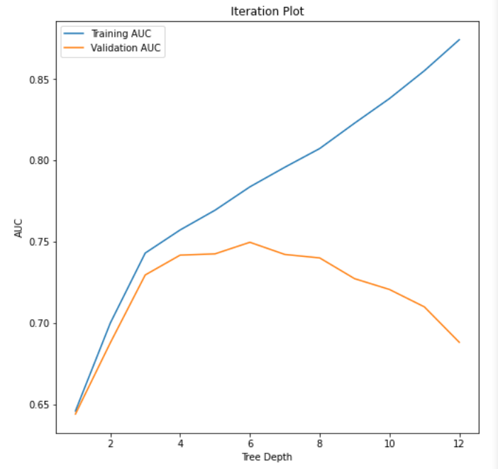
* **iterationplot**: 'LIMIT_BAL',
       'PAY_0', 'PAY_2', 'PAY_3', 'PAY_4', 'PAY_5', 'PAY_6', 'BILL_AMT1',
       'BILL_AMT2', 'BILL_AMT3', 'BILL_AMT4', 'BILL_AMT5', 'BILL_AMT6',
       'PAY_AMT1', 'PAY_AMT2', 'PAY_AMT3', 'PAY_AMT4', 'PAY_AMT5', 'PAY_AMT6'
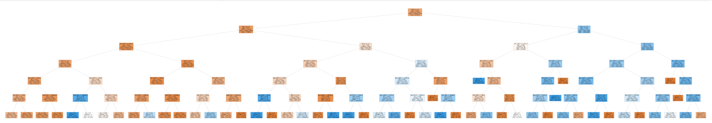
* **decisiontree**: 'LIMIT_BAL',
       'PAY_0', 'PAY_2', 'PAY_3', 'PAY_4', 'PAY_5', 'PAY_6', 'BILL_AMT1',
       'BILL_AMT2', 'BILL_AMT3', 'BILL_AMT4', 'BILL_AMT5', 'BILL_AMT6',
       'PAY_AMT1', 'PAY_AMT2', 'PAY_AMT3', 'PAY_AMT4', 'PAY_AMT5', 'PAY_AMT6'
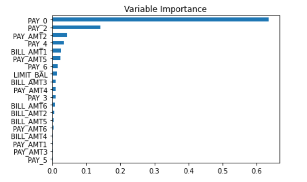
* **variableimportance**: 'LIMIT_BAL',
       'PAY_0', 'PAY_2', 'PAY_3', 'PAY_4', 'PAY_5', 'PAY_6', 'BILL_AMT1',
       'BILL_AMT2', 'BILL_AMT3', 'BILL_AMT4', 'BILL_AMT5', 'BILL_AMT6',
       'PAY_AMT1', 'PAY_AMT2', 'PAY_AMT3', 'PAY_AMT4', 'PAY_AMT5', 'PAY_AMT6'
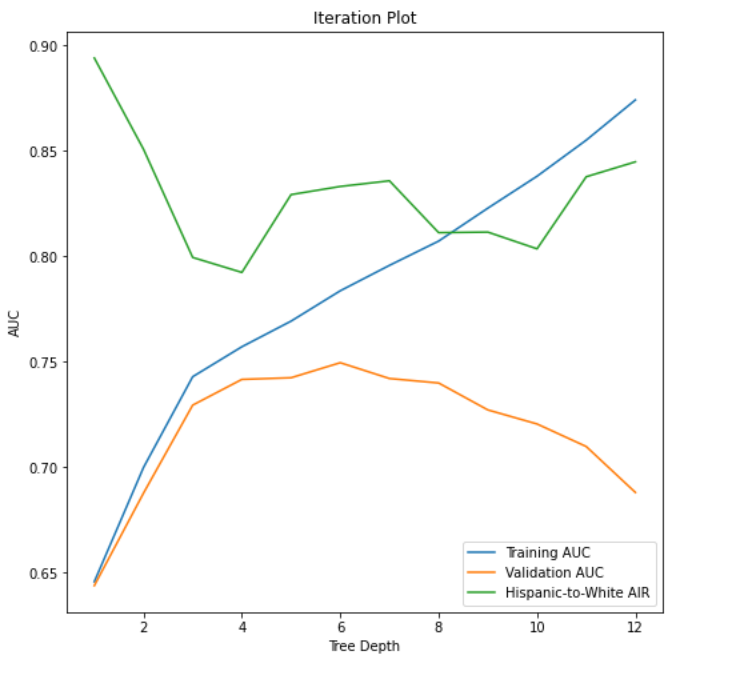
* **iterationplot2**: 'LIMIT_BAL',
       'PAY_0', 'PAY_2', 'PAY_3', 'PAY_4', 'PAY_5', 'PAY_6', 'BILL_AMT1',
       'BILL_AMT2', 'BILL_AMT3', 'BILL_AMT4', 'BILL_AMT5', 'BILL_AMT6',
       'PAY_AMT1', 'PAY_AMT2', 'PAY_AMT3', 'PAY_AMT4', 'PAY_AMT5', 'PAY_AMT6'

### Ethical considerations      

#### Describe potential negative impacts of using your model:
* **Columns used as inputs in the final model**: 'LIMIT_BAL',
       'PAY_0', 'PAY_2', 'PAY_3', 'PAY_4', 'PAY_5', 'PAY_6', 'BILL_AMT1',
       'BILL_AMT2', 'BILL_AMT3', 'BILL_AMT4', 'BILL_AMT5', 'BILL_AMT6',
       'PAY_AMT1', 'PAY_AMT2', 'PAY_AMT3', 'PAY_AMT4', 'PAY_AMT5', 'PAY_AMT6'
#### Describe potential uncertainties relating to the impacts of using your model:
* **Columns used as inputs in the final model**: 'LIMIT_BAL',
       'PAY_0', 'PAY_2', 'PAY_3', 'PAY_4', 'PAY_5', 'PAY_6', 'BILL_AMT1',
       'BILL_AMT2', 'BILL_AMT3', 'BILL_AMT4', 'BILL_AMT5', 'BILL_AMT6',
       'PAY_AMT1', 'PAY_AMT2', 'PAY_AMT3', 'PAY_AMT4', 'PAY_AMT5', 'PAY_AMT6'
#### Describe any unexpected or results
* **Columns used as inputs in the final model**: 'LIMIT_BAL',
       'PAY_0', 'PAY_2', 'PAY_3', 'PAY_4', 'PAY_5', 'PAY_6', 'BILL_AMT1',
       'BILL_AMT2', 'BILL_AMT3', 'BILL_AMT4', 'BILL_AMT5', 'BILL_AMT6',
       'PAY_AMT1', 'PAY_AMT2', 'PAY_AMT3', 'PAY_AMT4', 'PAY_AMT5', 'PAY_AMT6'


                       
